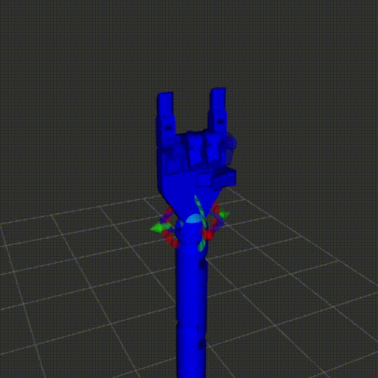

# Simple RoboArm



Test task. Contains URDF roboarm model and Python script for simple movements.

#### Usage

Build catkin workspace and init the environment:
```
cd ~/path/to/project
catkin_make
source devel/setup.bash
```
Launch simulation:
```
roslaunch roboarm_moveit demo.launch
```
Run test script:
```
roboarm_moveit/scripts/script.py
```